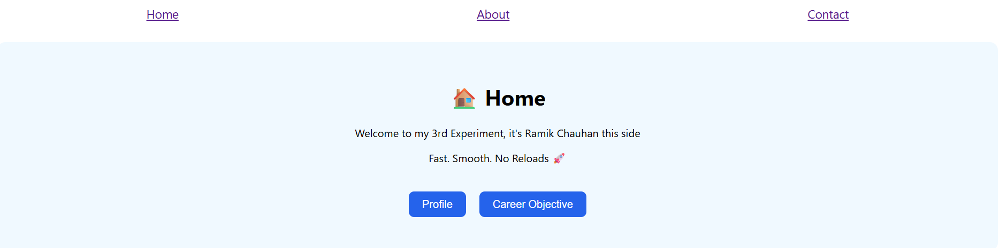
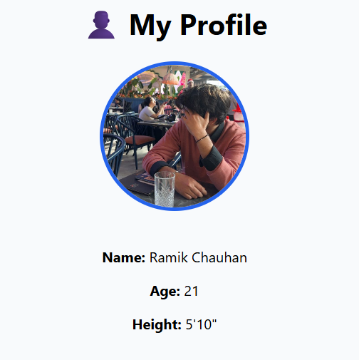
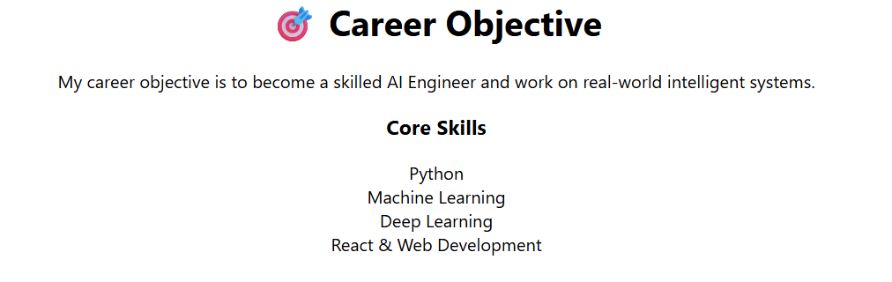
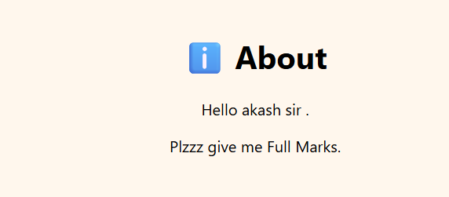

# 🚀 SPA Routing Lab – React Router

This project demonstrates **Single Page Application (SPA) routing** using **React Router**. It is designed as a **lab experiment project** covering basic routing, navigation, and multi-page SPA concepts with a clean and simple UI.

---

## 📌 Aim of the Project

To implement client-side routing in a React Single Page Application using React Router, enabling navigation between multiple views without reloading the page.

---

## 🧪 Experiments Covered

### ✅ Experiment 1: Basic Client-Side Routing

* Setup of `BrowserRouter`
* Defining routes using `Routes` and `Route`
* Rendering components based on URL

### ✅ Experiment 2: Navigation Using Link Component

* Navigation using `Link`
* Smooth page transitions without reload

### ✅ Experiment 3: Multi-Page SPA Using Routing

* Multiple pages (Home, About, Contact)
* Additional pages (Profile, Career Objective)
* Demonstrates real-world SPA behavior

---

## 🛠️ Technologies Used

* React
* React Router DOM
* JavaScript (ES6)
* CSS

---

## 📁 Project Structure

```
spa-routing-lab/
 ├─ src/
 │   ├─ components/
 │   │   ├─ Home.js
 │   │   ├─ About.js
 │   │   ├─ Contact.js
 │   │   ├─ Profile.js
 │   │   └─ Career.js
 │   ├─ assets/
 │   │   └─ profile.png
 │   ├─ App.js
 │   ├─ App.css
 │   ├─ index.js
 │   └─ index.css
 ├─ public/
 ├─ package.json
 └─ README.md
```

---

## 🖼️ Application Screenshots

### 🏠 Home Page


### 👤 Profile Page


### 🎯 Career Objective Page


### ℹ️ About Page


### 📞 Contact Page


### 🏠 Home Page


This is the landing page of the application. It provides navigation buttons to Profile and Career Objective pages and demonstrates smooth SPA routing without page reloads.

---

### 👤 Profile Page


This page displays personal profile details such as name, age, height, and a circular profile photograph, similar to a social media profile view.

---

### 🎯 Career Objective Page


This page describes the career goal of becoming an AI Engineer and lists core technical skills such as Machine Learning, Deep Learning, and Web Development.

---

### ℹ️ About Page


This page provides a brief about message and serves as an informational section of the application.

---

### 📞 Contact Page


This page displays contact information such as email address and phone number.

---

## ▶️ How to Run the Project

1. Open terminal in the project folder
2. Install dependencies (only once):

```bash
npm install
```

3. Start the development server:

```bash
npm start
```

4. Open browser and visit:

```
http://localhost:3000
```

---

## 🔁 How Routing Works (Simple Explanation)

* The application loads once in the browser
* Clicking links changes the URL
* React Router matches the URL with a route
* The corresponding component is rendered
* The page does not reload

---

## 👤 Additional Features

* Profile page with circular profile image
* Career Objective page with skills list
* Clean and simple UI
* Beginner-friendly code structure

---

## 🧠 Key Learning Outcomes

* Understanding of SPA concept
* Usage of React Router
* Difference between routing and page reload
* Component-based architecture

---

## 📌 Author

**Ramik Chauhan**
CSE (AI/ML Specialization)

---

## ✅ Conclusion

This project successfully demonstrates the implementation of routing in a Single Page Application using React Router. It provides smooth navigation, modular components, and a clear understanding of SPA behavior.

---

✨ *Fast. Smooth. No Reloads.*
